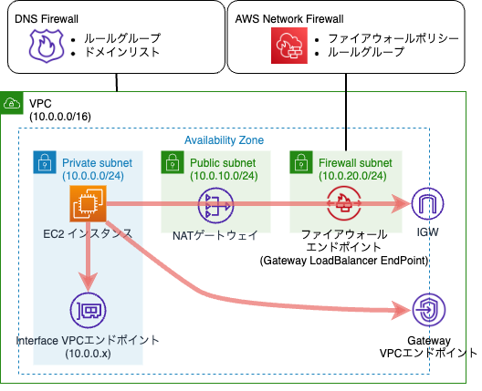

# jawsdays2022-cfn-template

JAWS DAYS2022のプレイベントにてご紹介したWalled Gardenアーキテクチャのリファレンス用のCloudFormationテンプレートです。

## Interfaceエンドポイント

Interfaceエンドポイントとして以下が作成されます。これらはSystems ManagerでEC2インスタンスを管理するために使用します。

- com.amazonaws.[region].ssm
- com.amazonaws.[region].ec2messages
- com.amazonaws.[region].ssmmessages

参考：https://aws.amazon.com/jp/premiumsupport/knowledge-center/ec2-systems-manager-vpc-endpoints/

## Gatewayエンドポイント

Gatewayエンドポイントとして以下が作成されます。このエンドポイントはAmazon Linux2 EC2インスタンスがパッケージを更新するために使用します。

- com.amazonaws.${AWS::Region}.s3

参考：https://aws.amazon.com/jp/premiumsupport/knowledge-center/ec2-al1-al2-update-yum-without-internet/

## AWS Network Firewall

AWS Network Firewallはデフォルトでは以下のドメインを許可し、それ以外のドメインは拒否します。

- google.com

## Route53 Resolver DNS Firewall

DNS Firewallはデフォルトでは以下のドメインを許可し、それ以外のドメインは拒否します。ドメイン`amazonaws.com`はAWSのサービスエンドポイントに対するDNSクエリを許可するためのものです。

- amazonaws.com
- google.com

## インスタンスプロファイルおよびIAMロール

本テンプレートはEC2インスタンスにアタッチするインスタンスプロファイルとIAMロールを作成します。IAMロールにはAWS管理ポリシー`AmazonSSMManagedInstanceCore`が適用されます。これにより、EC2インスタンスをSystems Managerで管理することができるようになります。本プロファイルはSession Manager機能を使用するために必要となります。

## 注意

本テンプレートの使用によって生じたトラブルにつきましては、当方は一切の責任を負いかねます。